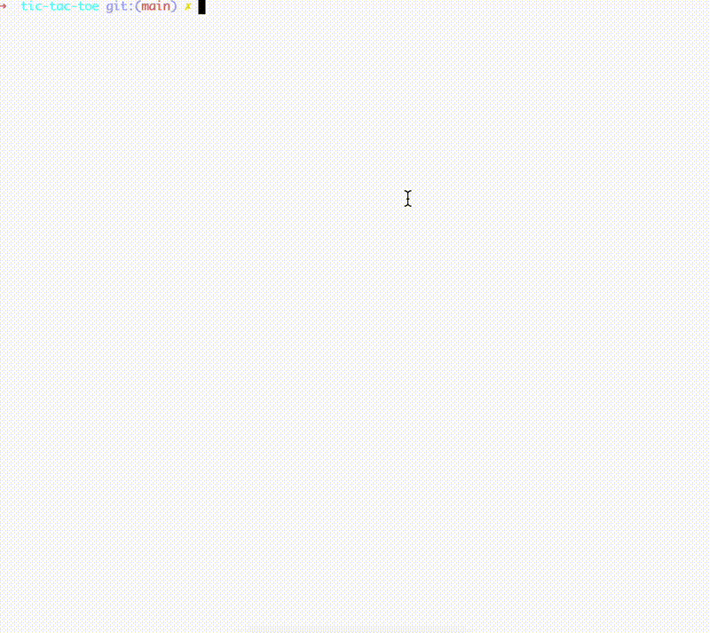

# Tic Tac Toe AI with OpenAI Integration

A NestJS-based Tic Tac Toe game that uses OpenAI's GPT models for intelligent gameplay. The AI opponent is trained using fine-tuning to make strategic moves based on the current board state.



## Features

- OpenAI GPT integration for AI moves
- Game state evaluation is performed by the GPT model
- Custom fine-tuned model training
- Terminal-based UI using blessed
- Responsive terminal interface
- Error handling and retry mechanisms

## Prerequisites

- Node.js
- npm
- OpenAI API key

## Installation

1. Clone the repository.
2. Install dependencies:

```bash
npm install
```

3. Create a `.env` file in the project root:

```env
OPENAI_API_KEY=your_api_key_here
OPENAI_MODEL=gpt-4o-mini-2024-07-18
FINE_TUNED_MODEL=ft:gpt-4o-mini-2024-07-18:your-org::your-model-id
OPENAI_TRAINING_FILE_ID=your-training-file-id
```

## Training the AI Model

### 1. Prepare Training Data

The training data is stored in `training_data.jsonl`. Each line contains a JSON object with the following structure:

```jsonl
{
  "messages": [
    {
      "role": "user",
      "content": "Game state: [['', '', ''], ['', '', ''], ['', '', '']]. You're 'O'. What's your next move?"
    },
    {
      "role": "assistant",
      "content": "{\"row\": 0, \"col\": 0}"
    }
  ]
}
```

You can add more training examples to improve the AI's performance.

### 2. Upload Training File

Run the upload script to send your training data to OpenAI:

```bash
npx ts-node scripts/upload-file.ts
```

This will output a File ID. Copy this ID and update your `.env` file's `OPENAI_TRAINING_FILE_ID`.

### 3. Create Fine-Tuned Model

Start the fine-tuning process:

```bash
npx ts-node scripts/create-finetune.ts
```

This will output a Fine-tune Job ID. The process may take several minutes to complete.

### 4. Update Environment Variables

Once fine-tuning is complete, update your `.env` file with the new model ID:

```env
FINE_TUNED_MODEL=ft:gpt-4o-mini-2024-07-18:your-org::your-new-model-id
```

## Running the Game

### Development Mode

```bash
npm run start:dev
```

### Production Mode

```bash
npm run build
npm run start:prod
```

## Game Controls

- Number keys (1-9) to make moves:

```
1 | 2 | 3
---------
4 | 5 | 6
---------
7 | 8 | 9
```

- 'r' to reset the game
- 'q' or 'Esc' to quit
- Tab/Shift+Tab to cycle focus

## Customization

### Modifying AI Behavior

1. Update the training data in `training_data.jsonl` with new examples
2. Re-run the training process
3. Update the model ID in your `.env` file

## Contributing

1. Fork the repository
2. Create a feature branch
3. Commit your changes
4. Push to the branch
5. Create a Pull Request

## License

This project is licensed under the MIT License. See the [LICENSE](LICENSE) file for details.

## Acknowledgments

- OpenAI for the GPT API
- Blessed library for terminal UI
- NestJS framework
